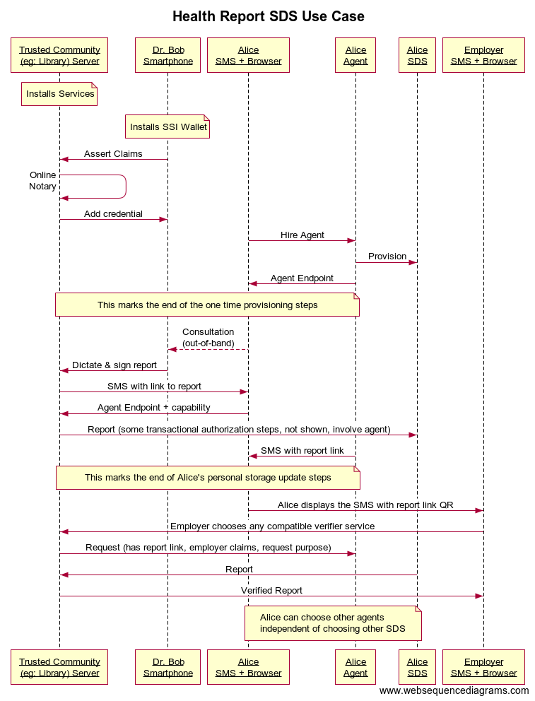

## ​2.1​ \[Covid-19\] Health Report Use Case

_Submitted by Adrian Gropper, with help from Juan Caballero (Spherity GmbH)_

## ​2.1.1.​ Summary
Alice’s health report is a short narrative impression of as little as one session of care signed by Dr. Bob to be presented to her employer and/or filed in her electronic health record. The use case reduces SSI adoption barriers by minimizing the scope of new software to three process changes:
1. A trusted local community organization fulfills the roles of Issuer and Verifier as a service but does not store documents, personal or private information long-term
1. A storage provider operates a secure data store that Alice ultimately controls
1. Dr. Bob installs a mobile wallet app to sign documents and present credentials

## ​2.1.2.​ Goal
The goal of this use-case is to inform the standards that will enable Alice to choose her access control agent separately from the storage or other processor services. This is important because Alice benefits greatly from her ability to choose and even switch among different storage or other processor services *independently* of her access control agent. Note: the millions of Alices in the world are not required to install or use new software or control DIDs in this use case to benefit from others doing so on their behalf.

As a use case early in the adoption curve of SSI systems, this use case highlights the relationship between essential standards:
* The VC subject (Bob) gets to choose their wallet independent of issuer or verifier.
* If the issuer does not yet support SSI, Bob gets to choose a proxy and notary.
* The verifier can choose a proxy different from the one Bob chose.
* Alice can choose her access control agent independent of storage, processing, or any other services rendered. If Alice has an SSI wallet or otherwise uses a DID to control an electronic health record, she can do that as well. See 2.1.6.2

## ​2.1.3.​ Assumptions
1. The town’s public library is trusted as an intermediary by all parties.
1. The Library, a privacy by default operator, does not keep documents or logs of personal information unless required by law.
1. Alice trusts the Library to recommend a compatible agent and/or secure data store.
1. Dr. Bob trusts the Library to recommend a compatible mobile wallet.
1. Dr. Bob’s credentials, e.g. a medical license number, are public information that should be broadly accessible.
1. Public health authorities publish guidelines for a health report that Dr. Bob can follow and Alice’s employer accepts as a verifier.

## ​2.1.4.​ Diagram

## ​2.1.5.​ Adoption Sequence

1. The Library installs Issuer / Verifier software and displays a list of compatible mobile wallets and secure data stores. Secure data 1. stores that enable independent choice of control agent and vice versa are called out as preferable by the library.
1. Dr. Bob installs a mobile wallet and is able to sign documents, post timestamps to a public blockchain or other timestamping service, 1. and satisfy legal retention of documents and signature proofs by sending them to his secure email address. 
1. The Library’s issuer software enables Dr. Bob to self-assert his medical license and use a public notary to countersign the credential. The notary’s record can be verified online.
1. Dr. Bob adds his notarized credential to his mobile wallet.
1. Alice uses her mobile phone number to sign up for a secure data store chosen from the Library’s list. If she doesn’t have one already, Alice receives, via SMS, a link to her authorization agent as suggested by the secure data store and picks a password.
1. Alice contacts Dr. Bob (out of band), gets whatever tests (out of band) and asks Dr. Bob to issue her a health report via the Library Issuer service. 
1. Dr. Bob accesses any Issuer service using his credentials, dictates the health report, adds Alice’s SMS number and signs the report, leaving a timestamp and a proof. Document and proof are sent to Dr. Bob’s secure email for legal retention.
1. Alice gets an SMS or secure email from the Library with a link to the report and proof. Alice clicks the link which opens as a form on the Library site. Alice enters her authorization server endpoint onto the form.
1. The Library server contacts Alice’s authorization server. Alice may have to sign-in. The health report and proof are sent to Alice’s secure data store.
1. The Library deletes the documents that Dr. Bob had stored temporarily for Alice.
1. Alice receives an SMS confirmation with a QR code that links to the document in the secure data store.
1. Alice goes to her employer and displays the QR code in the SMS message. 
1. The employer’s browser takes them to the Library. A capability or authorization issued by Alice may be involved in securing the report while it’s being copied from her data store to the verifier. 
1. The Library uses the capability/token/etc at Alice’s authorization server to get the document and proof from the secure data store.
1. The library verifies the document for the employer.
1. The library deletes the document from local storage, if applicable.

## ​2.1.6.​ Sequences Outlining Consequences of Migrating between Interoperable Vendors

A.) Later, Alice can decide to change her secure data store:
1. Alice decides to keep her authorization server but use a different secure data store.
1. Alice opens a new secure data store account and specifies her existing authorization server as her agent.
1. Alice moves her document from the old store to the new one.
1. If the employer wants to check Alice’s health report again after the change, the old QR code points to the same authorization server and a file that has moved to the new document store.
1. Where it is impossible to persist old links and references, Alice should at least be notified and have the option to manually or systematically issue a new QR code.

B.) Later, Alice changes her authorization server:
1. Alice decides to keep her new data store but change the authorization server.
1. Alice opens a new authorization server account. 
1. Alice goes to the new data store via its current authorization server and specifies her new authorization server. 
1. The employer wants to check Alice’s health report again. 
1. The old QR code points to the old authorization server. Alice has to create a new QR code that points to the new authorization server. This may need to be a manual operation, but either way is beyond the scope of this specification.

C.) Later, Dr. Bob wants to see the old report before dictating a new report:
1. Dr. Bob enters Alice’s SMS into a form at the Library.
1. The Library sends Alice a message asking for her current authorization server and a request for the old report.
1. Alice agrees and replies with a link to her current authorization server and document.
1. Dr. Bob, using the Library as a verifier, presents his credentials to Alice’s authorization server and retrieves the document. 

